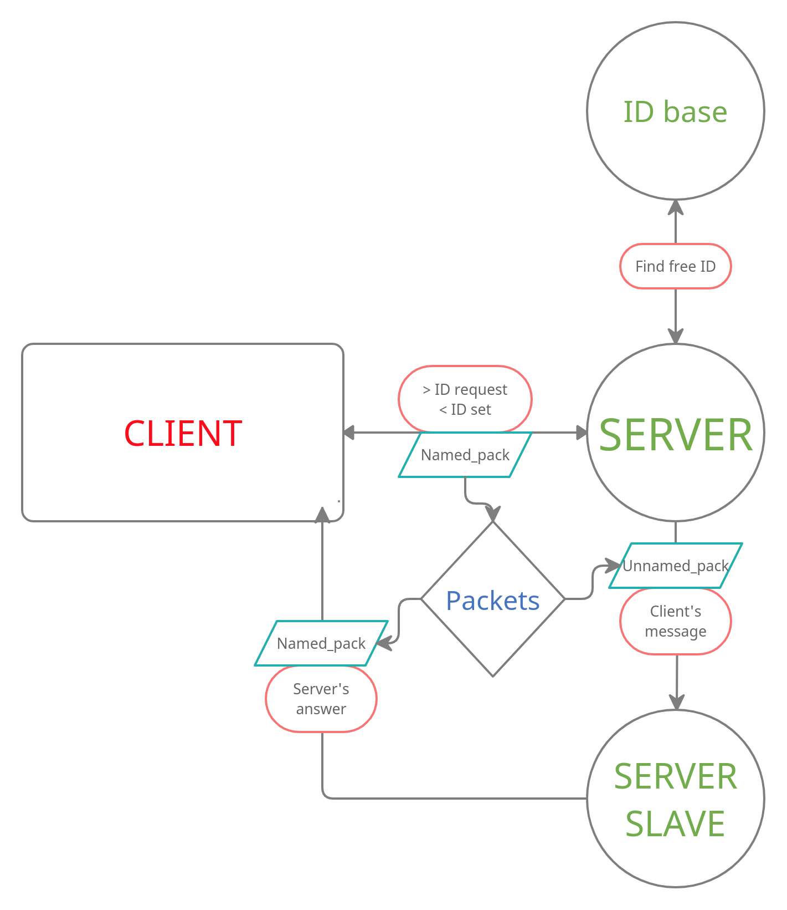

# Server
## Goncharov Mark

The MIPT project. The main target is to create stable TCP/UDP server, 
to control programming style, to add many useful properties, 
to pass different tests.

### Description
1. Requirements
2. Versions
3. Install
4. Usage
5. How it works

Requirements
============
1. TCP/UDP switch for server and client
2. Remote shell using ptmx
3. Server must work in daemon mode
4. Server must be broadcasted by client
5. Clients must be isolated to each other
6. Erros must be handling and processed properly (not killed process)
7. Everything must be logging (info/warning/error)
8. Should be control over loosing UDP packets
9. We have to use buildsystem like make/cmake and so on
10. Should be linked using own shared libraries
11. In order to save information should be used cryptography
12. Program should pass tests
13. Every program should properly handle signals like SIGKILL and so on

Versions
========
Now we have
-----------
| Task | Done | Preparing                         |
| :---:|:----:|:---------------------------------:|
| 1    | 0.8  | Common usage functions            |
| 2    | 1    | Done                              |
| 3    | 1    | Done                              |
| 4    | 1    | Done                              |
| 5    | 1    | Done                              |
| 6    | 0.9  | Returning values can be optimized |
| 7    | 1    | Done                              |
| 8    | 0    | Not started                       |
| 9    | 1    | Done                              |
| 10   | 0.2  | Linking -c for libs               |
| 11   | 0    | Soon                              |
| 12   | 0    | Tests weren't prepared            |
| 13   | 0.5  | Client is reaining                |

1. 08.04
```cpp
> Start README. Current targets:
> Optimize return value handling in functions
> Logging into /var/log
> Killing server more accurate
> Rewrite `CheckNewClient` without switch and so on
> One function-name style must be used
> Rename functions: GetID, AddID and so on...
> Close file-descr before `exec`
> Packet->data_ should be union for convient usage
> fgets can't be used in order to save from `dup2`
> Signal handling (can be used tcsetattr/cfmakeraw)
> Common usage for TCP and UDP
```

Install
=======
1. clone this repository
2. ```mkdir build; mkdir LOG```
3. ```make```

Usage
=====
1. ```make``` - compile program files
2. ```make server``` - creating daemon server
3. ```make client``` - creating client
4. ```make serverTCP``` and ```make clientTCP``` the same
5. Write ```exit``` in client in order to exit ##### client
6. Write ```CLOSE_SERVER``` in client in order to close ##### server
7. In order to fast closing UDP server can be used ```make close```
8. Use ```bash``` in client in order to use client like ordinary terminal

How it works
============

1. Client is sending request to server in order to get ID (UDP)
2. Server is searching free ID in ID_base
3. Returns ID to client and creating slave that will work on this client
4. Server now just check ID of new messages and translating them to slaves accordingly
5. Slaves just translate client's requst and give them necessary information