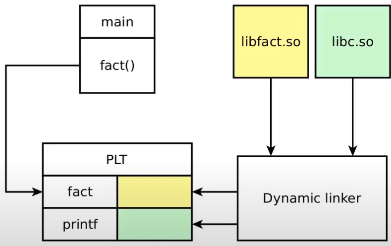

# Linker's work

### Goncharov Mark

This is a brief tutorial for shared libraries

In order to understand toolchain I recomend playlist: 
> https://www.youtube.com/watch?v=lUvcvmG6kIw&list=PL3BR09unfgchnggx7IJuSU57mxjMhrSaq&index=3
> 
------------
Positional independent code - command ```-fPIC```
> gcc -O2 -fPIC -c fact.c -o fact.o

Creating library: 
> gcc -shared fact.o -o libfact.so
------------
In order to link: ```gcc main.c -lfact -L.``` isn't enough. 
It can't find, because it's searching for libraries in special ways

Possible ways: 
> LD_LIBRARY_PATH=. ./a.out

This information can be in the executeble file: use ```rpath```
> gcc main.c -L. -lfact -Wl,-rpath,.
---------

PLT - Procedure Linkage Table